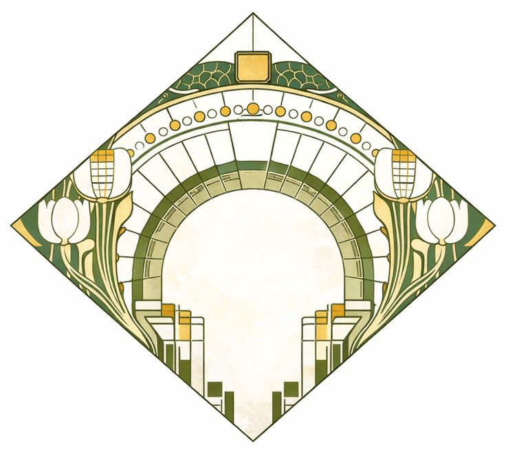

<div align="center">
	
</div>

## ponte-nova

> Bridging the gap between Nova and Node.js

[](https://github.com/idleberg/ponte-nova/blob/main/LICENSE)
[](https://www.npmjs.org/package/ponte-nova)


## Installation 💿

In GitHub, click on *"Use this template"* to create a new repo from this template. Alternatively, you can use `degitly`.

```shell
npm install ponte-nova
```

## Usage 🚀

That's the one thing you have to figure out!

## License ©️

This work is licensed under [The MIT License](LICENSE).
